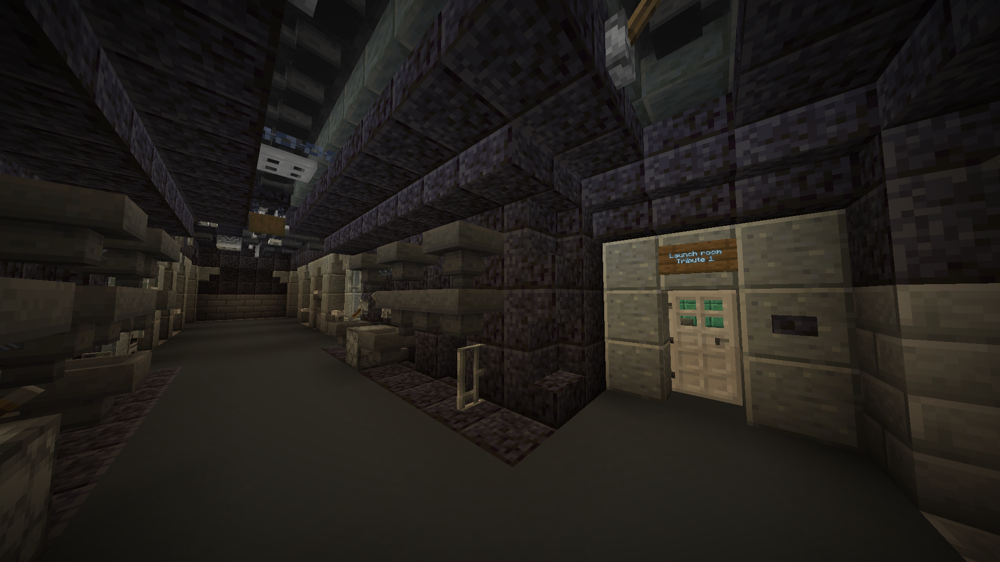
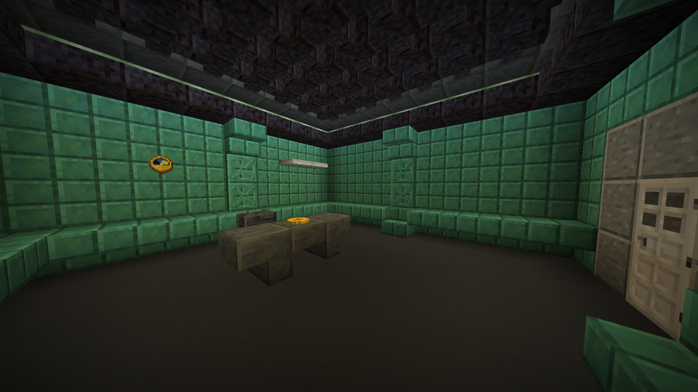
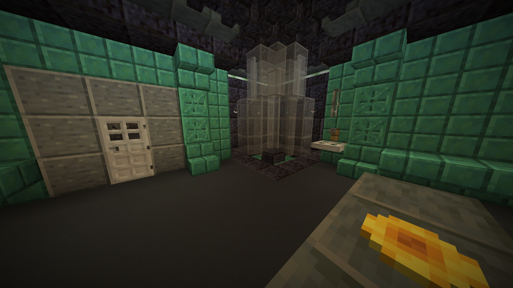
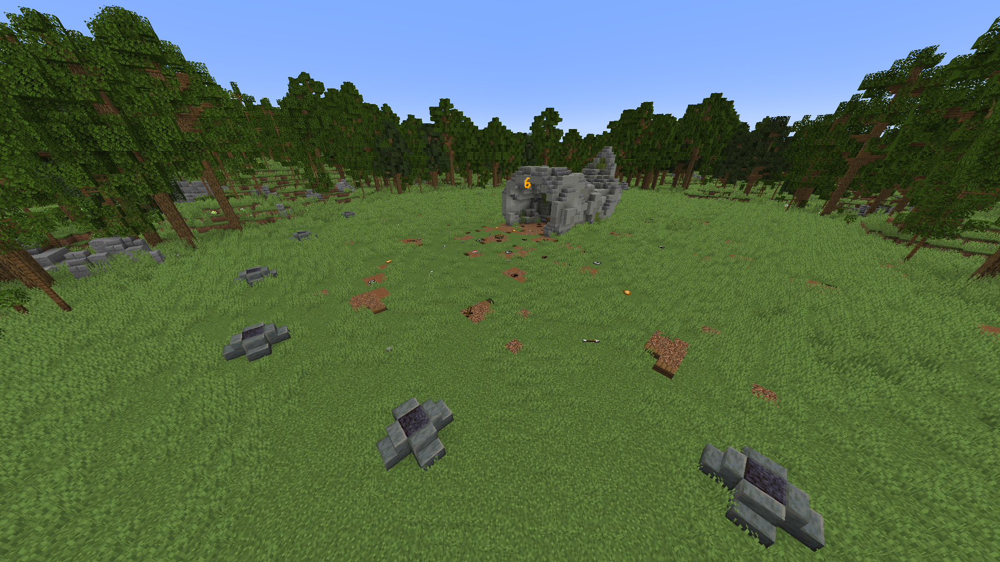
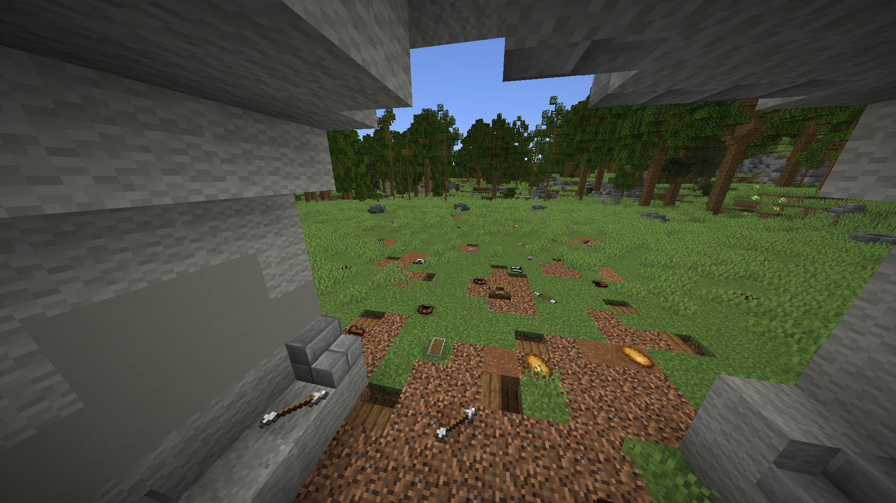
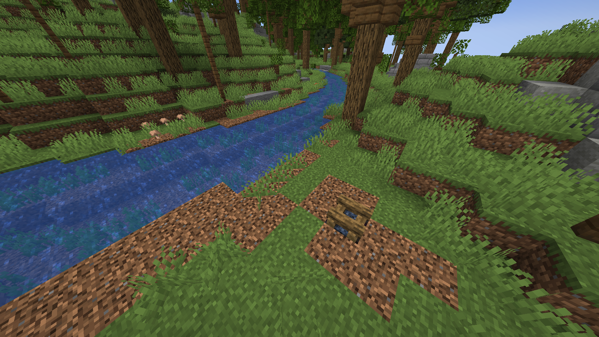

74th Arena
=============================

 - [Overview](#overview)
 - [Terrain](#terrain)
 - [Features](#features)
 - [Data packs](#data-packs)
 - [Controls](#controls)

-----------------------------

# Overview
This repository contains a [Minecraft][minecraft] world that is inspired by the [74th Hunger Games arena][74th-hunger-games-arena]. The world has custom developed data packs for extended vanilla functionallity, such as working tribute tubes, no GUI loot items and more.

[minecraft]: https://minecraft.wiki/w/Minecraft "Minecraft (official wiki)"
[74th-hunger-games-arena]: https://thehungergames.fandom.com/wiki/74th_Hunger_Games_arena "74th Hunger Games Arena (fandom wiki)"

# Terrain
The original [world][the-hunger-games-arena-map] makes up the exterior terrain for the arena, which was made by Flashness[^1]. I extended the world with the underground catacombs and launch rooms for tributes to enter the arena from as seen in the following images.

[][catacombs]
*Hallway in the catacombs leading to the launch room of tribute 1*

[][launch-room]
*Launch room with door looking at a table that has a tribute token item placed upon it*

[the-hunger-games-arena-map]: https://www.9minecraft.net/the-hunger-games-arena-map "The hunger games arena map (9minecraft)"
[catacombs]: https://thehungergames.fandom.com/wiki/Catacombs "Hunger games catacombs (fandom wiki)"
[launch-room]: https://thehungergames.fandom.com/wiki/Launch_Room "Hunger games launch room (fandom wiki)"

# Features
A full experience is created by combining data pack features that utilize vanilla game elements. Throughout a game experience the following features may be noticed.

## Launch
For dramatic effect tributes can be lifted into the arena using the tribute tube. The [arena elevator](#arena-elevator) data pack is used to lift players. In the launch room players can enter the elevator as seen in the following image.

[][tribute-tube]
*Entrance of the tribute tube viewed from within the launch room*

[tribute-tube]: https://thehungergames.fandom.com/wiki/Tribute_tube "Hunger games tribute tube (fandom wiki)"

## Start
After starting the game players will be held back on the platforms until the countdown ends. The countdown is displayed visually in the world as seen in the following image. Both the start positions and the countdown can be [setup](#placing-world-objects) using the [arena world](#arena-world) data pack.

*Platforms bend around the cornucopia center that has a countdown display upon it*

## Loot
Spread throughout the arena are loot items that can be picked up by players, as seen in the following image.

[][cornucopia]
*Looking out from within the cornucopia to the loot items layed out on the ground before the platforms*

[cornucopia]: https://thehungergames.fandom.com/wiki/Cornucopia "Hunger games cornucopia (fandom wiki)"

### Arena items
These items can be picked up by interacting with the entity. The default Minecraft control for interacting is right click. The functionality for the special items is found in the [arena item](#arena-item) data pack.

### Loot table
All items in the arena are picked based on the same loot table, which is stored in the [arena world](#arena-world) data pack. The items are placed at loot markers on the reset trigger.

## Reset
At any moment the arena can be reset to allow for a new match to ready itself. During the reset arena entities are removed, sweet berry bushes are grown to be pluckable and campfires are unlit.

> [!NOTE]
> Only sweet berry bushes and campfires that are set with the data pack are reset, see the [placing world objects](#placing-world-objects) section for how to setup new objects in the arena.

*Outer area of the arena with a campfire next to a creek*

# Data packs
Four data packs are combined for the use in the arena. The [arena elevator](#arena-elevator) and [arena item](#arena-elevator) data pack could be used separately for their functionality. Some functionality of the data packs can be altered by [adjusting data](#adjust-data) in game.

## Arena action
The [arena action][arena-action-data-pack] data pack manages player related functionality for the arena. The data pack allows [players](#players) to be given a tribute or gamemaker [role](#roles). Gamemakers are able to [trigger](#triggers) actions for the arena to take. Lastly gamemakers can manage [sponsering](#sponsering) for the tributes.

## Arena elevator
The [arena elevator][arena-elevator-data-pack] data pack provides an elevator for the arena. An elevator can be [created](#create-elevator-function) and [removed](#remove-elevator-function). Of course an elevator can also [lift](#lift-function) players inside.

#### [Create elevator function](world/datapacks/arena_elevator_v1.13/data/arena_elevator/function/create.mcfunction)
    /execute positioned ~ ~ ~ arena_world:create {block:$block_name%, height:%height%}

#### [Remove elevator function](world/datapacks/arena_elevator_v1.13/data/arena_elevator/function/remove.mcfunction)
    /execute as @n[predicate=arena_elevator:arena_elevator] run function arena_elevator:remove

#### [Lift function](world/datapacks/arena_elevator_v1.13/data/arena_elevator/function/lift.mcfunction)
    /execute as @n[predicate=arena_elevator:arena_elevator] run function arena_elevator:lift

## Arena item
The [arena item][arena-item-data-pack] data pack provides visible items for the arena. Items can be [created](#create-item-function) and [removed](#remove-item-function). For each created item an item display can have its item be [replaced](#replace-command) to change what item can be picked up by a player.

#### [Create item function](world/datapacks/arena_item_v1.12/data/arena_item/function/create.mcfunction)
    /function arena_item:create

#### [Remove item function](world/datapacks/arena_item_v1.12/data/arena_item/function/remove.mcfunction)
    /execute as @n[predicate=arena_item:arena_item] run function arena_item:remove

#### Replace command
    /execute as @n[predicate=arena_item:arena_item_display] run loot replace entity @s contents loot arena_world:arena_loot

## Arena world
The [arena world][arena-world-data-pack] data pack contains functionality for controlling the world for the arena. Most importantly this data pack can be used to [place world objects](#placing-world-objects).

[arena-action-data-pack]: world/datapacks/arena_action_v1.9 "Arena action v1.9"
[arena-elevator-data-pack]: world/datapacks/arena_elevator_v1.13 "Arena elevator v1.13"
[arena-item-data-pack]: world/datapacks/arena_item_v1.12 "Arena item v1.12"
[arena-world-data-pack]: world/datapacks/arena_world_v1.13 "Arena world v1.13"

# Controls
Various function of the [data packs](#data-packs) can be used to setup and manage the arena.

## Players
The [arena action](#arena-action) includes functions to manage players for the arena.

### Roles
In order to differentiate between players and moderators there are two roles. The tribute and gamemaker role can both be altered for a player by executing the [tribute add](#tribute-add-function), [tribute remove](#tribute-remove-function), [gamemaker add](#gamemaker-add-function) or [gamemaker remove](#gamemaker-remove-function) function.

#### [Tribute add function](world/datapacks/arena_action_v1.9/data/arena_action/function/tribute/add.mcfunction)
    /function arena_action:tribute/add

#### [Tribute remove function](world/datapacks/arena_action_v1.9/data/arena_action/function/tribute/remove.mcfunction)
    /function arena_action:tribute/remove

#### [Gamemaker add function](world/datapacks/arena_action_v1.9/data/arena_action/function/gamemaker/add.mcfunction)
    /function arena_action:gamemaker/add

#### [Gamemaker remove function](world/datapacks/arena_action_v1.9/data/arena_action/function/gamemaker/remove.mcfunction)
    /function arena_action:gamemaker/remove

### Sponsering
For making sponsering of players easier during a physical local server event some function are available. The [select function](#select-function) can be used to select the currently held item as the item to sponsor, which can be followed by the [receive function](#receive-function) to give the player executing the function the currently selected item. As a one command option the [give function](#give-function) allows a gamemaker to give the currently held item to the player with the specified name.

#### [Select function](world/datapacks/arena_action_v1.9/data/arena_action/function/sponsor/select.mcfunction)
    /function arena_action:sponsor/select

#### [Receive function](world/datapacks/arena_action_v1.9/data/arena_action/function/sponsor/receive.mcfunction)
    /function arena_action:sponsor/receive

#### [Give function](world/datapacks/arena_action_v1.9/data/arena_action/function/sponsor/give.mcfunction)
    /function arena_action:sponsor/give {name:%player_name%}

## Triggers
In order to ease the control of the arena the following triggers are made for gamemakers to use. The [arena action](#arena-action) will take care to update the state of the arena accordingly.

### Reset
Restores the arena to a 'clean' state that is prepared to be made ready for a game. An ideal state to [adjust data](#adjust-data) before starting the game.

### Launch
Starts the arena by launching tributes inside a tribute tube into the arena. After the tributes have been lifted and the countdown finished the games have begun.

### Player
Starts the arena by teleporting tributes to the start position markers in the arena. Then a countdown starts, after which the games have begun.

### Finish
Announces the winner of the games by checking for alive tributes. Additionally the spectating tributes are teleported to spectate the victor.

## Placing world objects
Special objects can be placed in the arena using the [arena world](#arena-world) data pack. The objects, [`berry_bush`][make-berry-bush], [`campfire`][make-campfire], [`countdown`][make-countdown], [`elevator`][make-elevator], [`loot`][make-loot], [`start_position`][make-start-position] and [`token`][make-token] can be made using the following function by replacing the respective name.

#### Make function
    /function arena_world:name/make

Further more animal spawn location can be marked by using the following command for either a [`land`][make-land] or [`water`][make-water] spawn position.

#### [Animal land function](world/datapacks/arena_world_v1.13/data/arena_world/function/animal/land.mcfunction)
    /function arena_world:animal/land

#### [Animal water function](world/datapacks/arena_world_v1.13/data/arena_world/function/animal/water.mcfunction)
    /function arena_world:animal/water

[make-berry-bush]: world/datapacks/arena_world_v1.13/data/arena_world/function/berry_bush/make.mcfunction "Make berry bush function"
[make-campfire]: world/datapacks/arena_world_v1.13/data/arena_world/function/campfire/make.mcfunction "Make campfire function"
[make-countdown]: world/datapacks/arena_world_v1.13/data/arena_world/function/countdown/make.mcfunction "Make countdown function"
[make-elevator]: world/datapacks/arena_world_v1.13/data/arena_world/function/elevator/make.mcfunction "Make elevator function"
[make-loot]: world/datapacks/arena_world_v1.13/data/arena_world/function/loot/make.mcfunction "Make loot function"
[make-start-position]: world/datapacks/arena_world_v1.13/data/arena_world/function/start_position/make.mcfunction "Make start position function"
[make-token]: world/datapacks/arena_world_v1.13/data/arena_world/function/token/make.mcfunction "Make token function"

[make-land]: #animal-land-function "Animal land function"
[make-water]: #animal-water-function "Animal water function"

## Adjust data
The [data packs](#data-packs) set default data that can be adjusted manually. Changing data is completly optional, but allows modification of behavior without having to modify the data pack files. Data that can be adjusted can be inspected by running the `/data get storage` command.

## Additional functions

Other functions that can be used from the [data packs](#data-packs) include a function to spawn an angry wolf as a threat to the players.

#### [Spawn threat function](world/datapacks/arena_world_v1.13/data/arena_world/function/threat/wolf/spawn.mcfunction)
    /function arena_world:threat/wolf/spawn

[^1]: I would be pleased to hear better references to the originial world author Flashness or the original upload for the world used.

[Minecraft]: 
